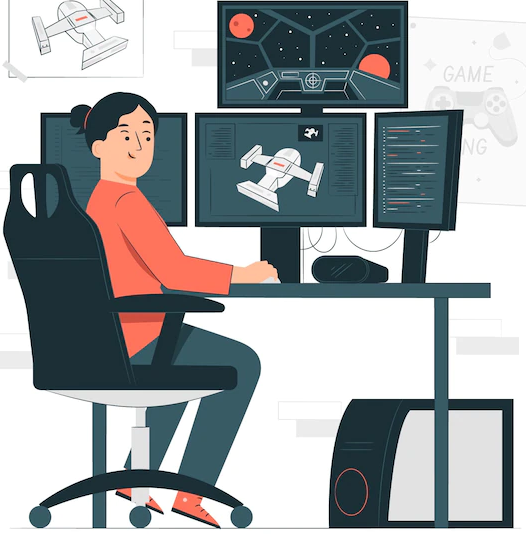
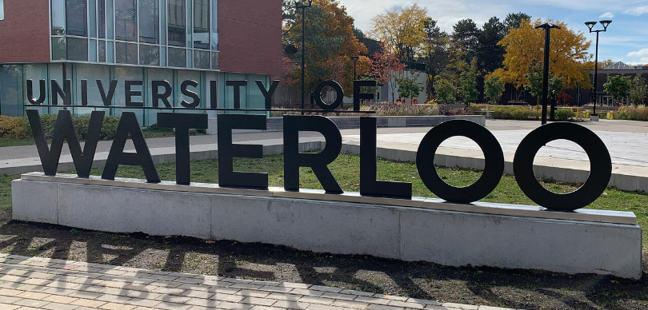

# Careers in Computer Science - Video Game Developer
By Kevin Huang

## Table of Contents

| Section  | Header  |
|---|---|
| 1.1  | Basics  |
| 1.2  | Education  |
| 1.3  | Experiential Learning  |
| 1.4  | Real Jobs  |
| 2.0  | Works Cited  |
---

# 1.1 Basics

Source: _(“Game developer Images | Free Vectors, Stock Photos & PSD”)_
 

### __Video Game Developer__

Video game making is something I have been eager to do and learn since I was young, and as such is the job I have picked for this research assignment. The role of a developer is to collaborate with others in order to design games. Oftentimes, they will attend meetings and workshops to improve upon their product and hopefully achieve commercial success. Generally college diploma is generally required, but most important is a portfolio based on your previous experiences and programming knowledge. 

### Skills Needed
* __Programming__ - Being able to code
* __Active listening__ - Being attentive to hear other opinions
* __Complex problem solving__ - Evaluating different methods and solving problems
* __Critical thinking__ - Using logic and reasoning to identify issues
* __Reading comprehension__ - Understanding written works and documentation
* __Artistic Talent__ - To create unique and memorable aspects in the game

* Salary: __$38-76k__ (low to high) 

#### _Source: (myBlueprint)_

---

# 1.2 Education

### __University of Waterloo__

#### _Source: (“First image of black hole captured | Waterloo News”)_
---

* Faculty of Mathematics
* Computer Science Undergraduate Degree (coop)
* Estimated Time: 5 Years

### __Requirements:__
* Six Grade 12 U/M course including:
    * Advanced Functions
    * Calculus and Vectors
    * Grade 12 English
    * Additional U course  
* Recommended to take Grade 11 Comsci
* Admission average: around __low 90s-mid 90s__ (individual selection based on both application and the AIF form that outlines personal achievements)
* Recommended to take Euclid/CSMC and/or CCC

 #### _Source: (“Computer Science | Undergraduate Programs”)_

---

### __Possible First Year Programs:__

### Sept to Dec:
* __CS 135__ - Designing Functional Programs
* __MATH 135__ - Algebra for Honours Mathematics
* __MATH 137__ - Calculus 1 for Honours Mathematics
* __SPCOM 100__ - Interpersonal Communication (Req. Communication Skills course)
* __Japan 101R__ - First-Year Japanese 1 (Elective)

### Jan to April:
* __CS 136__ - Elementary Algorithm Design and Data Abstraction
* __CS 136L__ – Tools and Techniques for Software Development
* __MATH 136__ – Linear Algebra 1 for Honours Mathematics
* __MATH 138__ – Calculus 2 for Honours Mathematics
* __JAPAN 102R__ - First-Year Japanese 2 (Elective)
* __PSYCH 101__ - Introductory Psychology (Elective)

#### _Source: (“Courses for your Computer Science degree | Undergraduate Programs”)_

---

# 1.3 Experiential Learning

The following things are many of the ways to attain valuable experience. Many of the mid/higher level jobs look for a __large game portfolio__ and lots of work experience. Many of these would make me a standout applicant due to having lots of experience, communication skills, passion projects, and problem solving skills.

### Ways to improve: 
* __Attending online coding competitions__ - To hone my algorithm/problem solving
* __Self-starter passion projects__ - Learning to manage my own projects, apply my technical skills
* __Coop__ - Gaining experiences at real work
* __Volunteering__ - Developing leadership and communication skills
* __Making my own games__ - A way to expand my knowledge within the industry and get experience with game engines
* __Learn multiple programming languages__ - To be able to work in a variety of platforms

#### Source: _(“Starting a Career in Video Game Development”)_

---

# 1.4 Real Jobs

### __Entry level:__

Software Developer/Programmer

* Mississauga, ON
* Salary: __Undefined__ (you ask for your salary range)
* Description: Not your everyday software developer position. Challenging and fast moving, yet friendly and supportive: a career you will look forward to every day. Work with intelligent people in an exciting environment where every month is different.

* Additional Requirements:
    * Do not need a formal degree in related field(s)
    * Fast learner
    * Passionate
    * Understanding in OOP

#### Source: _(“Software Developer / Programmer”)_

---

### __Mid Level:__

Game Developer (C#/Multiplayer)

* Remote Job (located in Toronto, ON)
* Salary: __$80k-120k__ (Full-Time)
* Description: Jump into developing a new multiplayer browser game with a talented remote team. Build the backend (C#) and front-end (Web/ Typescript) of the game with 1-2 other developers. Work with and help improve our (unity-like) proprietary multiplayer game engine, (Front-end: ECS+ Three.JS, Back-end: Box2d, ECS). Design, implement, maintain, and debug game code and features, while collaborating with artists and designers. Be a technical expert on our team

* Additional Requirements:
    * Thorough understanding of game engines
    * Web development experience
    * Experience in a game studio(s)/published your own game(s)
    * 3+ years experience in C#, Javascript, 3d & multiplayer development

#### Source: _(“Game Developer (C#/Multiplayer)”)_

---

### __Senior Level:__

Game Developer

* Remote Job (located in Vancouver, BC)
* Salary: __$90k-130k__ (Full-Time)
* Description: As a Senior Programmer at Smoking Gun Interactive (SGI), you’re a talented and driven person who enjoys working on great projects. You have experience in a variety of areas of game development and are able and willing to work on any area of game programming needed, with a focus on full-stack development experience.  You’re experienced in mentoring and training programmers and are interested in eventually moving into a leadership role.

* Additional Requirements:
    * 5+ Years of experience
    * Bachelor’s Degree in Computer Science
    * Expert in OOP, C++, and Standard Library
    * Provide mentorship to junior developers

#### Sources: _(“computer game developer”), (“Home”)_

---

# 2.0 Works Cited

